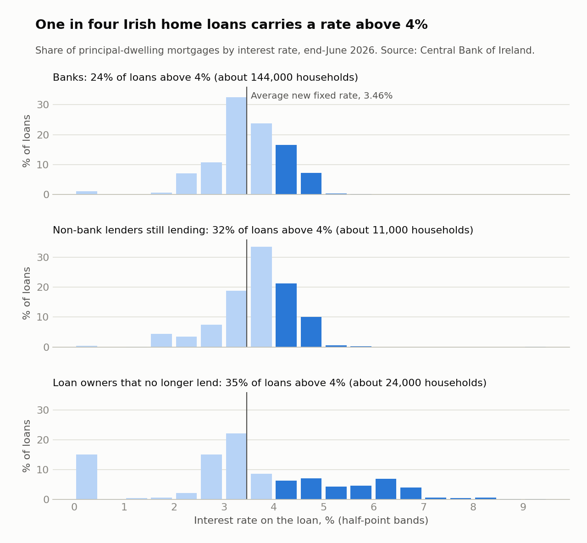
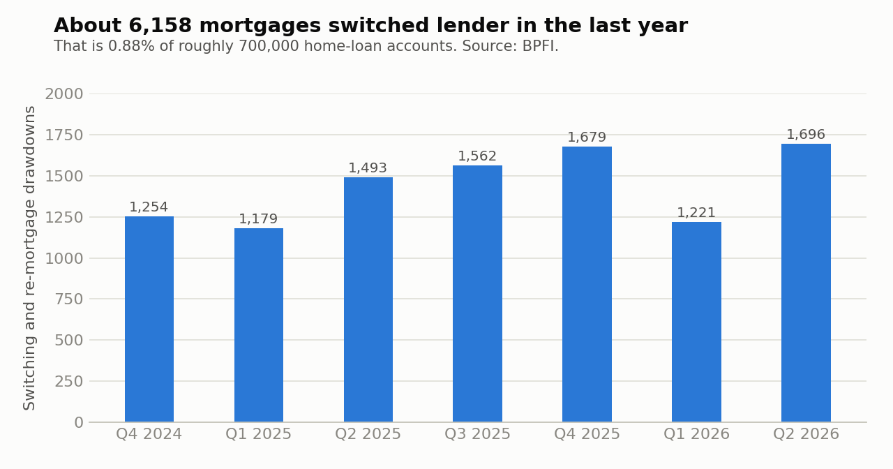
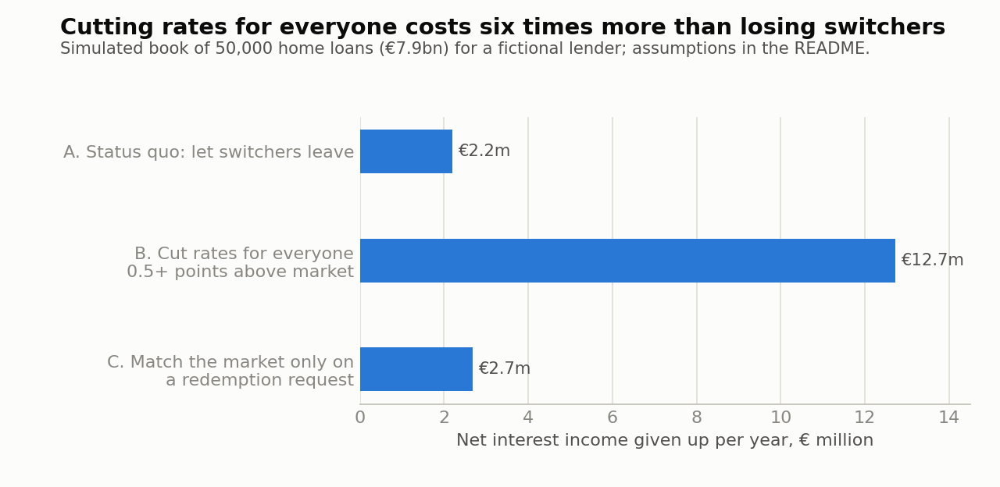

# The Loyalty Penalty

**One in four Irish mortgage holders pays over 4%. New customers pay 3.46%.**

A business analysis of the gap between what existing and new mortgage customers pay in Ireland: how big it is, who carries it, and what a lender should do about the income it stands to lose.

| | |
|---|---|
| Households paying more than 4% | about 180,000 (25.7% of roughly 700,000 home-loan accounts) |
| Interest paid above the 3.46% new-customer rate | about €316m a year, roughly €1,750 per household |
| Mortgages that switched lender in the last four quarters | 6,158, or 0.88% of accounts |
| Cost to a lender of letting switchers leave (simulated €7.9bn book) | €2.2m a year |
| Cost to the same lender of cutting rates for everyone above the market | €12.7m a year |

Data runs to June 2026. Market figures come from the Central Bank of Ireland, Banking & Payments Federation Ireland (BPFI) and bank annual reports. The lender's loan book is simulated, because loan-level data is not public.

## Findings

**1. Ireland is no longer expensive for new borrowers.** The average new mortgage rate was 3.49% in June 2026, just under the euro area average of 3.51%. A year earlier it was 0.31 points above.

**2. The gap is now between new and existing customers.**



**3. Almost nobody moves.** About 1 in 30 of the households above 4% switched lender in the last year. Far more renegotiate with their own lender (€586m in June 2026 alone), and they get an average fixed rate of 3.23%.



**4. Lenders have no commercial reason to close the gap.** Cutting rates only pays if about 24% of the affected customers would otherwise leave each year. The model's estimate for today is 4%.



**5. The larger exposure is internal repricing.** If a quarter of customers above the market move to a cheaper rate with the same lender, the simulated lender loses €6.4m a year, against €2.2m from switching today. Since 24 March 2026 the revised Consumer Protection Code requires lenders to show customers what they could save.

## Recommendation for a lender

1. Do not reprice the back book.
2. Put repricing in the financial plan: €3.9m to €6.4m a year of lost income on a book this size.
3. Build a digital rate-change journey that shows the saving 60 days before a fixed term ends.
4. Track two indicators monthly: share of the book switching out, and share repricing internally.

## What is in this repository

```
data/                 CSV files transcribed from public releases, plus sources.csv
sql/01_schema.sql     Tables, views and constraints (SQLite)
sql/02_queries.sql    12 named analytical queries
src/config.py         Every assumption, tagged sourced / derived / assumed
src/build_db.py       Loads the CSVs and the simulated loan book into SQLite
src/simulate_loan_book.py   Simulates 50,000 loans fitted to published figures
src/run_queries.py    Runs the SQL and exports each result
src/analysis.py       Market sizing, sensitivity, lender options, stress test
src/charts.py         Static charts
src/build_dashboard.py      Builds dashboard/index.html
src/checks.py         18 checks that the numbers reconcile
dashboard/index.html  Interactive dashboard with a household savings calculator
docs/                 Business analysis pack and a draft post
outputs/              Database, query results, tables, figures
```

## Run it

```bash
pip install -r requirements.txt
./run_all.sh
```

This rebuilds the database, runs the queries and the analysis, redraws the charts and the dashboard, and runs the checks.

## SQL used

| Query | Technique | Question |
|---|---|---|
| q01 | Conditional aggregation | Do BPFI segments add up to the published totals? |
| q02 | `LAG` over four quarters, join | Switching volume, average loan and year-on-year growth |
| q03 | Rolling window frame, cross join | Annual switching rate against the stock of accounts |
| q04 | Filtering, derived measure | Ireland against the euro area, in basis points |
| q05 | View with `UNION ALL` and `LAG` | Cumulative distribution to accounts per rate band |
| q06, q07 | Common table expressions, parameters from a table | Interest paid above the benchmark |
| q08 | `LAG` partitioned by bank | Income per basis point of margin; year-on-year change |
| q09 | `CASE` segmentation, window share | Who in the loan book is free to move |
| q10 | Running total | Fixed-rate loans reaching the end of their term |
| q11 | `NTILE` deciles, cumulative share | How concentrated the savings are |
| q12 | Scalar subqueries, `UNION ALL` | Does the simulated book match its targets? |

## Method

1. **Size the gap.** The Central Bank publishes the share of home loans at or below each half-point rate, for banks, non-bank lenders and loan owners that no longer lend. The share in each band is multiplied by that lender type's account count and average balance. Each loan is placed at the middle of its band. Interest above 3.46% is summed for bands above 4%.
2. **Simulate a loan book.** Rates are drawn from the published distribution for banks. The product mix follows BPFI (67% fixed, 18% tracker, 15% variable). The variable-rate average is tuned to the Central Bank's 4.15%.
3. **Model the lender's options.** Each loan's chance of switching rises with its saving, scaled so the book loses 0.88% of loans a year. Options are compared on annual net interest income.

## Assumptions

| Assumption | Value | Basis |
|---|---|---|
| Benchmark rate | 3.46% | Sourced: average new fixed rate, June 2026 |
| Renegotiation rate | 3.23% | Sourced: average fixed renegotiation rate, June 2026 |
| Rate that counts as materially above market | 4.00% | Assumed |
| Position of loans within each rate band | Midpoint | Assumed |
| Funding cost | 2.25% | Assumed |
| Switching costs | €1,850 | Derived: legal and valuation fees plus VAT |
| Fixed loans roll onto the variable rate if the customer does nothing | 3.96% | Sourced rate, assumed behaviour |
| Redemption requests that are real switches | 70% | Assumed |
| Customers who accept a matching offer at that stage | 35% | Assumed |

Sensitivity results are in `outputs/tables/`. With the 3.46% benchmark held fixed, the €316m estimate ranges from €184m to €387m.

## Limits

- €316m is a gap in rates, not money every household can collect. Published data does not show how many of these loans are inside a fixed term, where leaving early can carry a fee.
- About 33,400 home loans were in arrears at end-June 2026 and are unlikely to be able to switch. Removing all of them leaves about 146,500 households above 4%.
- Balances and account counts for non-bank lenders are from June 2025, the latest split published.
- The simulated book has no real customers. Its results show the direction and rough size of each option, not a forecast for any actual lender.
- Options are compared on one year of net interest income. Credit losses, capital and operating costs are not modelled.
- Arrears totals and some bank results were transcribed from press coverage of the official releases. Check them against the primary tables before relying on them.
- This is analysis, not financial advice.

## Sources

See `data/sources.csv` for links. Main sources: Central Bank of Ireland (Mortgage Interest Rate Distributions, Retail Interest Rates, Mortgage Arrears), BPFI Mortgage Drawdowns Reports, and the 2025 annual results of AIB, Bank of Ireland and PTSB.
